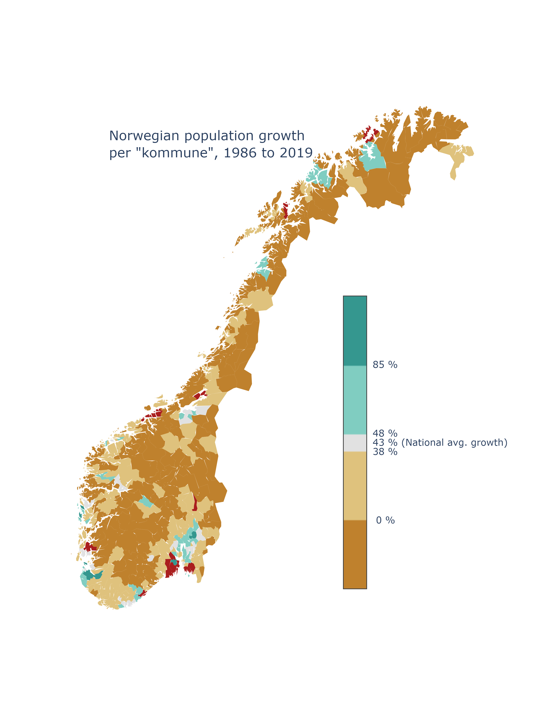

# Norwegian Population Growth (per Kommune, 1986 - 2019)

This repository contains code for creating a choropleth map of population growth per kommune in Norway from 1986 to 2019. A color scale is used to emphasize the deviation from national growth in the same period. This should to some extent show urbanization of Norway (assuming the reader is familiar with locations of the larger Norwegian cities)

Population data is downloaded from SSB (Statistics Norway, https://www.ssb.no) and geographic boundaries are downloaded from Geonorge (https://kartkatalog.geonorge.no)

